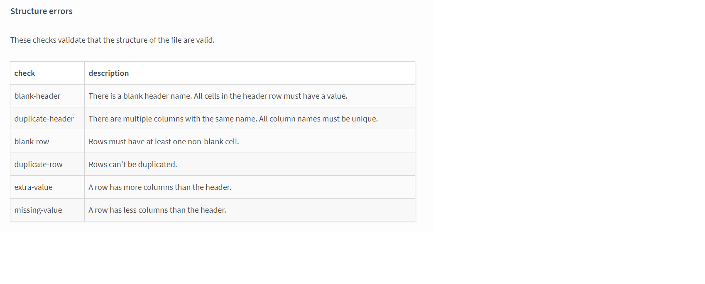

# HBKU seminar Goodtables

This is the repository for the goodtables seminar presented at HBKU MA in Digital Humanities, on 24/2/2021. It contains the mock .csv file, the original .xlsx file, and a .csv version with only 999 rows for use on the goodtables.io tool. Both .csv versions have errors in either row duplication or missing headers.  

You can clone this repository (or download one of the files) and replicate the Goodtables validation on http://goodtables.io/. 

Goodtables tool is going to be used for **structural** validation of a file. 

